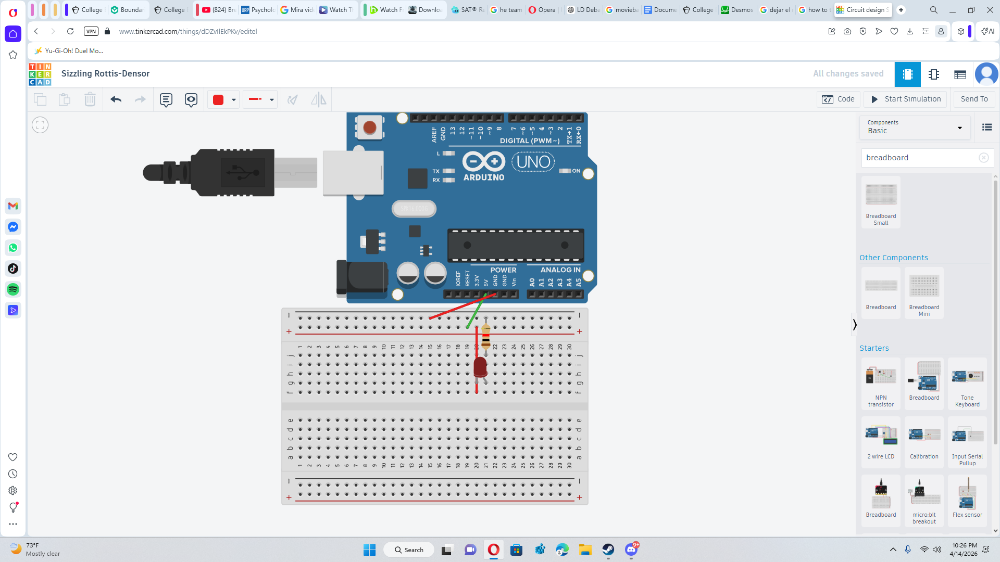
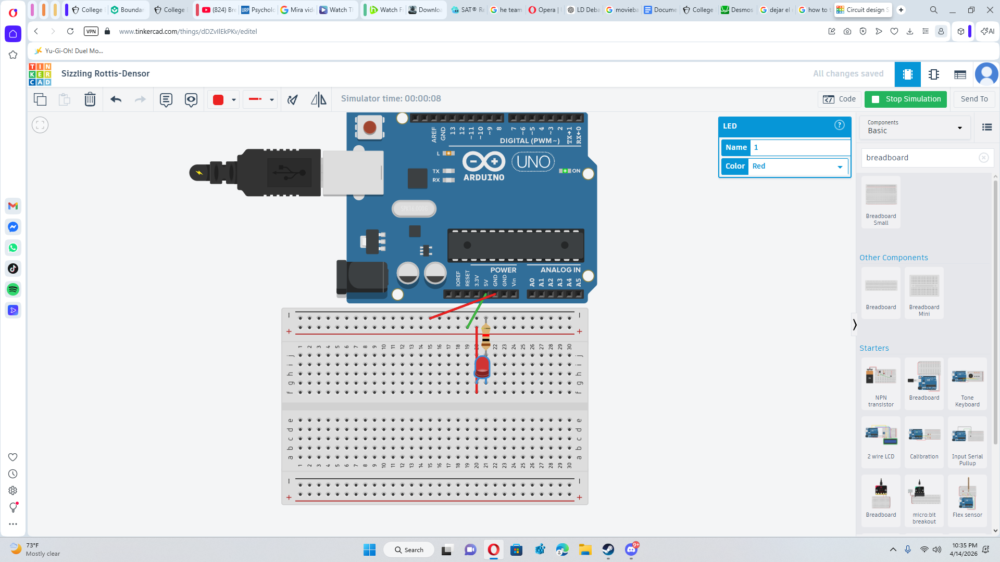

# Project 1: LED Basic Circuit

## Goal
Light up an LED using a simple Tinkercad circuit.

## Items
- LED
- Resistor
- Breadboard
- Arduino / 5V source

## First Attempt

I placed the LED incorrectly on the breadboard.

## Final Result

I fixed the wiring and correctly connected:
Power (5V) → Resistor → LED → Ground

## What I Learned
- How a basic circuit works
- LED polarity matters
- How resistors protect components
